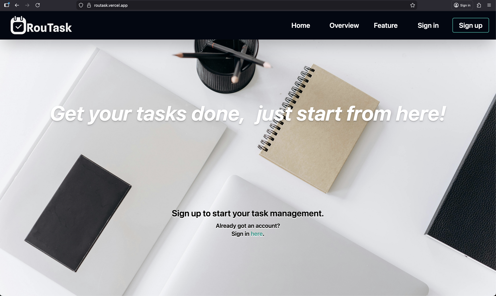
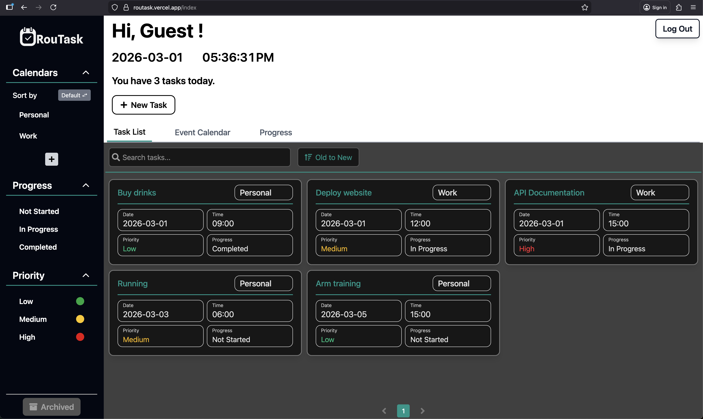
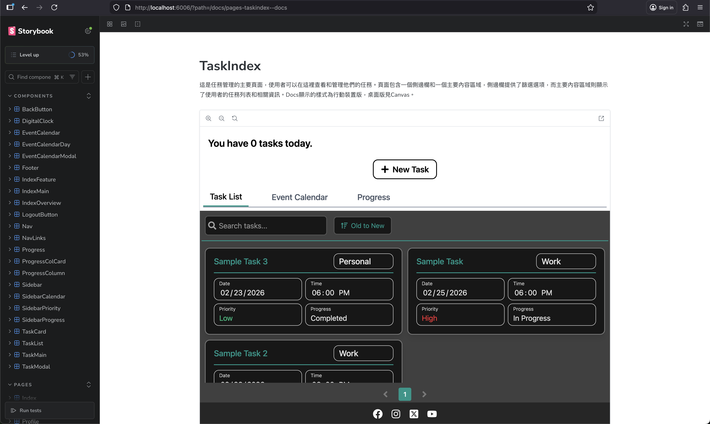

# **Routask-行事曆與任務管理系統**

### Routask 是一個MERN Full Stack專案。本專案透過Zustand全域狀態管理，實現了會員系統、任務管理等功能在前端與後端、資料庫的資料即時同步。

### 網站連結：https://routask.vercel.app

### 展示影片連結：https://reurl.cc/NNWLrq




## **技術架構**

### **前端(Frontend)**

- **React & Vite:** 利用Vite的熱更新(HMR)特性提升開發效率。
- **Zustand:** 輕量、直覺的狀態管理，實現管理全域的會員與任務狀態。
- **Tailwind CSS:** 快速設定樣式以及響應式網頁設計(RWD)。
- **date-fns:** 處理複雜的日期加減與格式化，確保日曆邏輯的穩定性。
- **@dnd-kit/core:** 實現Progress View的任務抓取、拖曳。

### **後端(Backend)**

- **Node.js & Express:** 建立RESTful API、處理跨源資源共享(CORS)。
- **MongoDB & Mongoose:** 使用非關聯式資料庫儲存會員資料、任務資訊，並透過model與資料庫互動。
- **Passport.js (JWT Strategy)：** 建立使用者的身份驗證，並透過jwt token存取後端路由。
- **Joi:** 建立Validation檢查傳入資料格式是否與資料庫要求相符。

## **功能清單**

### **會員系統：**

- 帳號註冊、登入、登出
- 修改會員資料、修改密碼
- 忘記密碼重設

### **任務管理：**

- 新增任務、刪除任務、封存任務
- 編輯任務之標題、日期、時間、進度、優先度、所屬行事曆、地點、備註、是否為循環任務、循環間隔

### **任務篩選：**

- 透過任務管理頁面左側的行事曆、進度、優先度進行任務篩選
- 顯示已封存之任務
- 行事曆可自由新增、修改、刪除(所屬任務也會跟著刪除)

### **任務檢視：**

- 清單模式：列出所有任務，可透過篩選、標題查詢、依時間排序來顯示相符條件之任務
- 月曆模式：顯示每日所包含的任務，可透過篩選顯示相符條件之任務
- 進度模式：依各進度顯示處在該進度的任務，可透過篩選、依時間排序顯示相符條件之任務，並透過拖曳來改變任務進度
- 三種檢視模式下皆可點選任務進行編輯

## **專案結構**

```
├── client/              # React
│   ├── src/
│   │   ├── components/  # UI 組件
│   │   ├── hooks/       # 自定義 Hook (例如 useBodyScrollLock)
│   │   ├── services/    # Axios API 封裝
│   │   ├── store.tsx    # Zustand 狀態中心
│   │   ├── types.ts     # TypeScript 型別定義
│   │   └── App.tsx      # 全域路由設定
└── server/              # Node.js (Express)
    ├── config/          # Passport 策略設定
    ├── models/          # Mongoose 資料模型
    ├── routes/          # API 路由拆解
    ├── validation.js    # Joi 表單驗證
    └── index.js         # 後端進入點 (連接 MongoDB 與初始化伺服器)
```

## **部署(Deployment)**

本專案採用前後端分離架構，並透過以下雲端平台達成自動化部署 (CI/CD)，確保系統的穩定性與擴展

### **前端託管：[Vercel](https://vercel.com/)**

- **框架優化：** 針對 React 與 Next.js 提供原生支援，確保最佳的渲染效能與加載速度。
- **自動化 CI/CD：** 整合 GitHub，每次推送代碼後自動進行構建 (Build) 與部署，並產出預覽連結供即時測試。
- **全球加速：** 透過 Vercel 的 Edge Network 節點，大幅降低全球使用者的訪問延遲。

### **後端託管：[Render](https://render.com/)**

- **穩定運行：** 提供完整的 Node.js 執行環境，適合處理 Express API 的高併發請求。
- **環境管理：** 簡便的環境變數 (Environment Variables) 設定，確保資料庫連接字串與 API Key 的安全性。
- **自動部署：** 監測 main 分支的更新，實現無縫代碼部署。

### **資料庫：[MongoDB Atlas](https://www.mongodb.com/cloud/atlas)**

- **雲端託管：** 無需自行維護伺服器，提供 99.9% 的高可用性與自動備份機制。
- **安全性：** 透過 IP 白名單與進階加密技術，確保開發環境與生產環境的資料安全。
- **彈性縮放：** 根據數據存取量自動調整資源，適合應對任務管理系統中頻繁的 CRUD 操作。

## **本地安裝與運行**

1. Install mongodb-community.
2. Change file name .env.example -> .env or create .env file in client folder.
3. Fill yout ip and server port in VITE_API_URL in .env file in client folder.
4. Change file name .env.example -> .env or create .env file in server folder.
5. Fill yout ip and client port in CLIENT_ORIGIN in .env file in server folder.
6. Start mongodb-community.
7. Command: `npm install` in server folder.
8. Command: `npm install` in client folder.
9. Command: `node index.js` in server folder.
10. Command: `npm run dev` in client folder.
11. Go http://localhost:5173 or http://yourIP:yourPort in browser.

## **Storybook（組件開發與檢視）**

👉 [查看Storybook](https://routask-storybook.vercel.app/)



- 確認已在 `client` 安裝專案相依（若尚未執行）：

```bash
cd client
npm install
```

- 啟動本地 Storybook（預設在 `6006` 埠）：

```bash
cd client
npm run storybook
```

- 開啟瀏覽器並前往： http://localhost:6006

- 建置靜態 Storybook（用於部署或分享）：

```bash
cd client
npm run build-storybook
```

## **開發指引（快速摘要）**

完整的開發指引已存放於 `.github/copilot-instructions.md`。以下為快速啟動與主要慣例：

- **前端（client）：**

```bash
cd client
npm install
npm run dev
```

- **後端（server）：**

```bash
cd server
npm install
npm start
```

- 主要檔案與慣例：元件使用 PascalCase 並放在 `client/src/components/`；hook 放在 `client/src/hooks/`；服務（API）放在 `client/src/services/`；TypeScript 型別集中於 `client/types.ts`。
  更多開發規範、程式風格與流程請參閱 `.github/copilot-instructions.md`。
